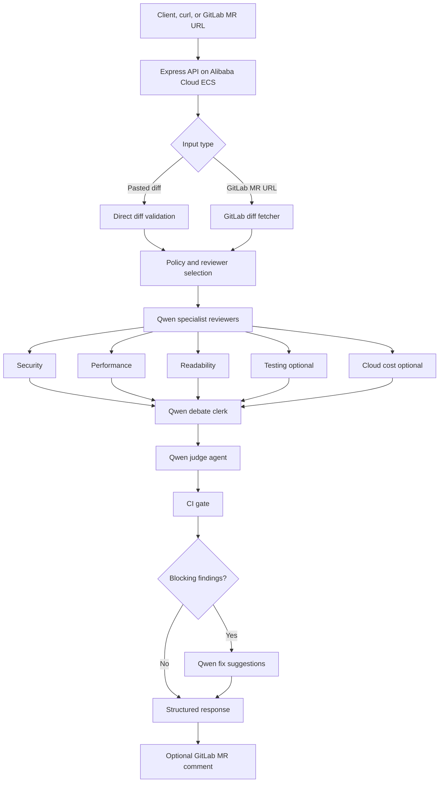

# PR Docket

PR Docket is a stateless, multi-agent code review demo. Paste a small git diff or provide a GitLab merge request URL. Three Qwen-powered specialists review security, performance, and readability in parallel, then a fourth judge agent weighs their findings.

## Architecture



### Request flow

1. The API accepts either a pasted diff through `/api/review` or a GitLab merge request URL through `/api/review-mr`.
2. GitLab MR reviews fetch changed files through the GitLab API, skip non-reviewable files, and batch large diffs.
3. Optional team policy and custom reviewer selection are normalized before any Qwen call.
4. Selected Qwen specialist reviewers produce structured, evidence-based findings.
5. A Qwen debate clerk reconciles duplicates, removes weak claims, and summarizes conflicts.
6. A Qwen judge agent decides whether the change can merge, needs discussion, or requires changes.
7. The API returns structured JSON with reviewer findings, debate notes, judge verdict, CI gate status, and optional fix suggestions.
8. For GitLab MRs, PR Docket can optionally post the review summary back to the merge request.

### Qwen agents

- `security`: injection, secrets, validation, auth, unsafe deserialization.
- `performance`: N+1 queries, inefficient loops, missing caching, excessive allocations.
- `readability`: naming, complexity, duplication, maintainability, missing docs.
- `testing`: missing regression tests, weak assertions, brittle tests, untested edge cases.
- `cloud_cost`: unbounded model/API usage, expensive polling, wasteful network/storage/compute patterns.
- `debate clerk`: reconciles specialist findings before judging.
- `judge`: produces the final merge decision.
- `fix suggester`: proposes bounded remediation suggestions for blocking issues.

## Run locally

Use Node.js 18 or newer. Start the API in one terminal:

```bash
cd server
npm install
cp .env.example .env
# Add your QWEN_API_KEY to .env
npm run dev
```

Then start the React app in another terminal:

```bash
cd client
npm install
npm run dev
```

Open `http://localhost:5173`. The API runs at `http://localhost:3001`; its health endpoint is `GET /health`.

## Qwen Cloud setup

Create an account in the [Alibaba Cloud Model Studio console](https://modelstudio.console.alibabacloud.com/), enable the international DashScope service, and create an API key. Copy `server/.env.example` to `server/.env` and set:

```env
QWEN_API_KEY=your_key_here
PORT=3001
GITLAB_TOKEN=
GITLAB_URL=https://gitlab.com
```

Never commit the `.env` file. The server uses the official `openai` npm client with Qwen's OpenAI-compatible international endpoint. To point the frontend elsewhere, create `client/.env` with `VITE_REVIEW_API_URL=https://your-api.example/api/review`.

## GitLab merge requests

Public GitLab.com projects work without additional credentials. For private projects, create a GitLab project or personal access token with `read_api` scope and set `GITLAB_TOKEN` in `server/.env`. To post PR Docket results back to an MR, the token needs permission to create merge request notes, such as GitLab's `api` scope. For a self-managed instance, set `GITLAB_URL` to its origin; submitted MR URLs are restricted to that origin to prevent arbitrary server-to-server requests.

The server uses GitLab's supported `GET /projects/:id/merge_requests/:iid/diffs` endpoint, groups files into bounded batches, aggregates each specialist's findings, and sends the combined three-reviewer result to the judge. GitLab and model context limits can cause very large or binary files to be skipped; the UI reports the reviewed and skipped file counts.

## API demo

Use the deployed ECS backend URL when judging the API. Replace `http://47.84.109.97` with another deployment host if needed.

### Health check

```bash
curl http://47.84.109.97/health
```

Expected response:

```json
{"status":"ok"}
```

### Readiness check

```bash
curl http://47.84.109.97/ready
```

Expected response when Qwen is configured:

```json
{"status":"ready"}
```

If `QWEN_API_KEY` is missing, the endpoint returns `503`:

```json
{"status":"not_ready","missing":["QWEN_API_KEY"]}
```

### Review a pasted diff

```bash
curl -X POST http://47.84.109.97/api/review \
  -H "Content-Type: application/json" \
  -d '{"diff":"diff --git a/routes/users.js b/routes/users.js\n--- a/routes/users.js\n+++ b/routes/users.js\n@@ -1,3 +1,4 @@\n+const users = await db.query(\"SELECT * FROM users WHERE name = \" + req.query.name);"}'
```

Response shape:

```json
{
  "reviewers": [
    {
      "key": "security",
      "verdict": "request changes",
      "severity": 5,
      "issues": [
        {
          "title": "SQL injection risk",
          "file": "routes/users.js",
          "line_hint": "+1",
          "severity": 5,
          "confidence": "high",
          "evidence": "User input is concatenated into a SQL query.",
          "recommendation": "Use parameterized queries instead of string concatenation."
        }
      ]
    }
  ],
  "debate": {
    "resolved_conflicts": [
      "Security and readability both identified the unsafe SQL construction; preserved it as a blocking security finding."
    ],
    "removed_findings": [],
    "summary": "The specialist findings were reconciled before the judge verdict."
  },
  "judge": {
    "verdict": "changes requested",
    "rationale": "The security finding is blocking because user input reaches SQL without parameterization.",
    "reviewer_count": 3,
    "blocking_count": 1,
    "suggestion_count": 2
  },
  "ci": {
    "passed": false,
    "max_severity": 5,
    "blocking_count": 1,
    "exit_code": 1
  },
  "fix_suggestions": [
    {
      "title": "Use a parameterized SQL query",
      "file": "routes/users.js",
      "risk": "SQL injection through concatenated user input.",
      "suggested_patch": "- const users = await db.query(\"SELECT * FROM users WHERE name = \" + req.query.name);\n+ const users = await db.query(\"SELECT * FROM users WHERE name = ?\", [req.query.name]);",
      "confidence": "medium"
    }
  ]
}
```

The `debate` object is produced by a reconciliation agent that merges duplicate findings, removes weak claims, and gives the judge a cleaner set of specialist opinions.

The `ci` object makes the result usable as an automated quality gate. A reviewer severity of `4` or `5` fails the gate with `exit_code: 1`; lower severities pass with `exit_code: 0`.

The `fix_suggestions` array is generated only when the CI gate fails. Suggestions are bounded, advisory, and should be reviewed by a human before applying.

### Select custom reviewers

By default, PR Docket runs `security`, `performance`, and `readability`. Requests can choose a custom reviewer set to control cost and focus the review.

Available reviewers:

- `security`
- `performance`
- `readability`
- `testing`
- `cloud_cost`

```bash
curl -X POST http://47.84.109.97/api/review \
  -H "Content-Type: application/json" \
  -d '{
    "diff":"diff --git a/server/billing.js b/server/billing.js\n+await qwen.chat.completions.create(payload);",
    "reviewers":["security","testing","cloud_cost"]
  }'
```

The response includes the active reviewer keys:

```json
{"reviewer_keys":["security","testing","cloud_cost"]}
```

### Apply a team review policy

Both `/api/review` and `/api/review-mr` accept an optional `policy` object. The policy is injected into the Qwen reviewer prompts so teams can enforce project-specific expectations.

```bash
curl -X POST http://47.84.109.97/api/review \
  -H "Content-Type: application/json" \
  -d '{
    "diff":"diff --git a/server/auth.js b/server/auth.js\n+console.log(process.env.SECRET_KEY);",
    "policy":{
      "require_tests_for":["server/","src/api/"],
      "forbidden_patterns":[
        {"name":"Hardcoded secret","pattern":"sk-","severity":5},
        {"name":"Production console logging","pattern":"console.log","severity":2}
      ],
      "extra_instructions":[
        "Flag missing authorization checks on admin or billing routes.",
        "Prefer actionable findings with file and line evidence."
      ]
    }
  }'
```

The response includes whether a policy was applied:

```json
{"policy_applied":true}
```

See `.prdocket.example.yml` for a repo-level policy example. The current API accepts the policy as JSON so deployments do not need a YAML parser dependency.

### Review a GitLab merge request

```bash
curl -X POST http://47.84.109.97/api/review-mr \
  -H "Content-Type: application/json" \
  -d '{"url":"https://gitlab.com/group/project/-/merge_requests/42"}'
```

Public GitLab.com merge requests can be reviewed without a token. Private projects require `GITLAB_TOKEN` on the server.

To post the Qwen judge summary back to the merge request, set `post_comment` to `true` and provide a GitLab token with note/comment permission:

```bash
curl -X POST http://47.84.109.97/api/review-mr \
  -H "Content-Type: application/json" \
  -d '{"url":"https://gitlab.com/group/project/-/merge_requests/42","post_comment":true}'
```

Comment posting is best-effort. If GitLab rejects the note because the token is missing or lacks permission, the API still returns the review and includes:

```json
{
  "gitlab_comment": {
    "posted_to_gitlab": false,
    "error": "GITLAB_TOKEN is required to post a merge request comment."
  }
}
```

## Scope

This hackathon version keeps no database, user accounts, or webhook automation. In production, a GitLab webhook could trigger the same merge-request review pipeline when an MR is opened or synchronized.

## Improvement roadmap

These are the highest-impact improvements for turning PR Docket from a hackathon demo into a stronger product and a more competitive submission.

### Innovation and AI creativity

- Add evidence-based findings instead of plain issue strings. Each Qwen reviewer should return `file`, `line_hint`, `evidence`, `risk`, `confidence`, and `recommendation` so every claim is traceable to the diff.
- Add custom reviewer profiles such as `frontend`, `backend`, `database`, `testing`, `cloud-cost`, and `accessibility` instead of only security, performance, and readability.
- Add a repo policy file such as `.prdocket.yml` so teams can define required reviewers, forbidden patterns, required test coverage rules, and project-specific review standards.
- Add a reviewer debate step where Qwen compares conflicting findings, removes weak claims, and sends a cleaner set of findings to the judge agent.
- Add patch suggestions in unified diff format for blocking issues so the tool can move from review-only to review-and-fix assistance.

### Technical depth and engineering

- Replace free-form issue strings with a structured issue schema that is easier to validate, render, test, and post back to GitLab.
- Add request validation for `/api/review` and `/api/review-mr`, including body shape, content type, MR URL format, and maximum diff size.
- Add rate limiting and concurrency limits to protect Qwen quota and keep the deployed backend stable under public access.
- Add token and cost controls by estimating diff size before calling Qwen, capping batches, and reporting skipped files with explicit reasons.
- Add structured logs with request id, review type, batch count, Qwen latency, GitLab latency, and error category.
- Add tests for GitLab URL parsing, diff batching, malformed Qwen JSON fallback, missing API key handling, empty diff handling, and large diff rejection.
- Add a CI-oriented response mode with `passed`, `blocking_count`, and `max_severity` so the result can gate pull requests automatically.
- Add Docker health checks and a `/ready` endpoint that verifies required runtime configuration such as `QWEN_API_KEY`.

### Problem value and product direction

- Position PR Docket as AI code-review triage: it catches obvious risks before human review and helps senior reviewers spend time on the hardest decisions.
- Add GitLab MR comment posting so the backend can publish the judge verdict and top findings directly into the merge request.
- Add a human-review handoff summary with the top blockers, files needing attention, and suggested reviewer expertise.
- Add confidence levels so teams can distinguish directly evidenced findings from items that need human verification.
- Keep the product self-hostable for private codebases, with all secrets provided through environment variables.

### Presentation and documentation

- Add an architecture diagram showing the flow from pasted diff or GitLab MR URL to Qwen specialist reviewers, judge agent, and structured verdict.
- Add API examples for `GET /health`, `POST /api/review`, and `POST /api/review-mr` with sample request and response bodies.
- Add a demo script with a known vulnerable diff and the expected security, performance, readability, and judge outputs.
- Add a judging-alignment section that maps the implementation to innovation, technical depth, problem impact, and documentation criteria.
- Add limitations clearly: Qwen can miss context outside the diff, large diffs may be truncated, private GitLab projects require a token, and AI review does not replace human approval.

The strongest next milestone is to make PR Docket a GitLab AI review bot: submit an MR URL, run the Qwen specialist review pipeline, and post a structured judge summary back to the MR as a comment.

## Alibaba Cloud deployment

The backend is packaged for Alibaba Cloud ECS in `server/Dockerfile`. Follow the step-by-step [Alibaba ECS deployment runbook](deploy/alibaba-ecs.md). The container reads Qwen and GitLab credentials only from environment variables and exposes the `/health` endpoint for deployment proof.
